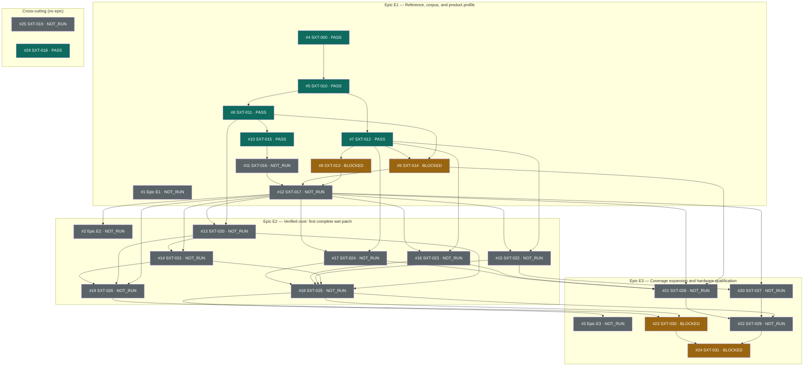

# gf180-surge

A hardware canary for a Surge XT subset synthesis engine — polyphonic,
multi-scene, with effects — targeting the GlobalFoundries **gf180mcu** open
PDK.

Proposed first product: a live, polyphonic hardware instrument that preserves
a selected set of **complete Surge presets, including their effects**, at
48 kHz, with external host/controller/DAC/storage. A preset counts as
supported only when its complete wet sound passes the fidelity contract; a
preset with a substituted generic effect is an *adapted* preset and does not
count.

The sound reference is Surge's own engine, pinned at
[`surge-synthesizer/surge@58914e59c608ed4384ba6002e44c3465c58b2e71`](https://github.com/surge-synthesizer/surge/tree/58914e59c608ed4384ba6002e44c3465c58b2e71).
The RTL must match a frozen fixed-point model exactly; model-vs-reference
comparisons use declared error budgets.

## Status

Planning. The executable backlog is defined in
[docs/surge-xt-chip-plan-v0.1-2026-09-20.md](docs/surge-xt-chip-plan-v0.1-2026-09-20.md)
and tracked in GitHub issues.

Completed:

- **SXT-000 — preliminary static preset census** of the pinned bundled corpus
  (3,561 presets, verified against Git blob identities), with reproducible
  outputs in [corpus/census-v0.1/](corpus/census-v0.1/). This is an
  inventory and prioritization aid only; it makes no audio-support claim.

Epics:

- **E1 — Reference, corpus, and product profile** (#1): native pinned-Surge
  oracle, normalized patch graphs, render fixtures, favorites and fidelity
  policy, effects contribution, resource accounting, profile freeze.
- **E2 — Verified core: first complete wet patch** (#2): patch-image
  compiler, timed control, first dry voice, Delay/EQ, Reverb1, one complete
  wet preset, wavetable assets.
- **E3 — Coverage expansion and hardware qualification** (#3): voice and
  effect leaves by measured recovery, full coverage publication, FPGA +
  external memory, gf180 qualification.

Reuse: sibling 2AMLogic infrastructure (Parasynth, TorchSynth, DX7, klt) is
adopted only through the survey in
[docs/REUSE-AUDIT.md](docs/REUSE-AUDIT.md) and its adoption-decision issue
(#25); sibling DSP is rejected — the only DSP oracle is the pinned Surge
engine.

Backlog DAG (generated; do not edit by hand):

<!-- DAG:BEGIN -->
<!-- Compiled from docs/dag.json by tools/compile_backlog_dag.py — do not edit by hand. Edit docs/dag.json and re-run `python3 tools/compile_backlog_dag.py render`; the dag-check CI job re-validates freshness on every pull request. Bookkeeping only: claim status of backlog issues — no capability, fidelity, or hardware claim. -->

| Status | Nodes |
|---|---|
| READY | 0 |
| IN PROGRESS | 0 |
| BLOCKED | 4 |
| NOT RUN | 16 |
| PASS | 6 |
| FAIL | 0 |
| NO VERDICT | 0 |
| STALE | 0 |
| **Total nodes** | **26** |

Claim counts, not a completion percentage or a quality score. READY is unrun, not PASS.
Coverage and agreement are reported separately by the underlying evidence; this board merges neither.

Node status and evidence (26 nodes)

| Node | Planning ID | Title | Status | Evidence |
|---|---|---|---|---|
| [#1](https://github.com/2AMLogic/gf180-surge/issues/1) | E1 | Epic: E1 — Reference, corpus, and product profile | NOT RUN | aggregate of members |
| [#2](https://github.com/2AMLogic/gf180-surge/issues/2) | E2 | Epic: E2 — Verified core: first complete wet patch | NOT RUN | aggregate of members |
| [#3](https://github.com/2AMLogic/gf180-surge/issues/3) | E3 | Epic: E3 — Coverage expansion and hardware qualification | NOT RUN | aggregate of members |
| [#4](https://github.com/2AMLogic/gf180-surge/issues/4) | SXT-000 | SXT-000: Preliminary static census (DONE) | PASS | [`corpus/census-v0.1/results/summary.json`](corpus/census-v0.1/results/summary.json) |
| [#5](https://github.com/2AMLogic/gf180-surge/issues/5) | SXT-010 | SXT-010: Build the native oracle | PASS | [`reports/sxt-010/EVIDENCE.md`](reports/sxt-010/EVIDENCE.md) |
| [#6](https://github.com/2AMLogic/gf180-surge/issues/6) | SXT-011 | SXT-011: Export normalized patch graphs | PASS | [`reports/sxt-011/EVIDENCE.md`](reports/sxt-011/EVIDENCE.md) |
| [#7](https://github.com/2AMLogic/gf180-surge/issues/7) | SXT-012 | SXT-012: Create render fixtures | PASS | [`reports/sxt-012/EVIDENCE.md`](reports/sxt-012/EVIDENCE.md) |
| [#8](https://github.com/2AMLogic/gf180-surge/issues/8) | SXT-013 | SXT-013: Freeze favorite selection and fidelity policy | BLOCKED | — |
| [#9](https://github.com/2AMLogic/gf180-surge/issues/9) | SXT-014 | SXT-014: Measure effects' contribution | BLOCKED | — |
| [#10](https://github.com/2AMLogic/gf180-surge/issues/10) | SXT-015 | SXT-015: Create resource accounting | PASS | [`reports/sxt-015/EVIDENCE.md`](reports/sxt-015/EVIDENCE.md) |
| [#11](https://github.com/2AMLogic/gf180-surge/issues/11) | SXT-016 | SXT-016: Run representative cost probes | NOT RUN | — |
| [#12](https://github.com/2AMLogic/gf180-surge/issues/12) | SXT-017 | SXT-017: Freeze profile v1 | NOT RUN | — |
| [#13](https://github.com/2AMLogic/gf180-surge/issues/13) | SXT-020 | SXT-020: Compile patch images | NOT RUN | — |
| [#14](https://github.com/2AMLogic/gf180-surge/issues/14) | SXT-021 | SXT-021: Implement timed control and scheduling | NOT RUN | — |
| [#15](https://github.com/2AMLogic/gf180-surge/issues/15) | SXT-022 | SXT-022: Qualify a first dry voice slice | NOT RUN | — |
| [#16](https://github.com/2AMLogic/gf180-surge/issues/16) | SXT-023 | SXT-023: Implement Delay and EQ | NOT RUN | — |
| [#17](https://github.com/2AMLogic/gf180-surge/issues/17) | SXT-024 | SXT-024: Implement Reverb1 | NOT RUN | — |
| [#18](https://github.com/2AMLogic/gf180-surge/issues/18) | SXT-025 | SXT-025: Pass one complete wet preset | NOT RUN | — |
| [#19](https://github.com/2AMLogic/gf180-surge/issues/19) | SXT-026 | SXT-026: Add Wavetable asset and playback support | NOT RUN | — |
| [#20](https://github.com/2AMLogic/gf180-surge/issues/20) | SXT-027 | SXT-027: Generate remaining voice-feature leaf issues | NOT RUN | — |
| [#21](https://github.com/2AMLogic/gf180-surge/issues/21) | SXT-028 | SXT-028: Expand effects by measured recovery | NOT RUN | — |
| [#22](https://github.com/2AMLogic/gf180-surge/issues/22) | SXT-029 | SXT-029: Run full qualification and publish coverage | NOT RUN | — |
| [#23](https://github.com/2AMLogic/gf180-surge/issues/23) | SXT-030 | SXT-030: Qualify FPGA and external memory | BLOCKED | — |
| [#24](https://github.com/2AMLogic/gf180-surge/issues/24) | SXT-031 | SXT-031: Qualify the GF180 implementation | BLOCKED | — |
| [#25](https://github.com/2AMLogic/gf180-surge/issues/25) | SXT-019 | SXT-019: Reuse substrate adoption decision | NOT RUN | — |
| [#29](https://github.com/2AMLogic/gf180-surge/issues/29) | SXT-018 | SXT-018: Backlog DAG + evidence-derived status board (README marker block) | PASS | [`reports/sxt-018/EVIDENCE.md`](reports/sxt-018/EVIDENCE.md) |

Dependency graph (mermaid, grouped by epic)

<!-- DAG:END -->

## License

This repository is Apache-2.0 (`LICENSE`), following the 2AMLogic canary
convention. The pinned Surge reference, its bundled presets, and SST
dependencies are GPL-3.0-or-later or carry their own terms; that material
stays in the external pinned oracle. Copying Surge-derived code, tables, or
assets into this repository requires a visible license decision record first.
No distribution-license determination has been made for a future chip
product.

## Ground rules

Three judgments are kept separate throughout:

1. the RTL matches the frozen fixed-point model;
2. the model reproduces the pinned Surge reference;
3. the instrument sounds good.

Passing one never establishes the others.
